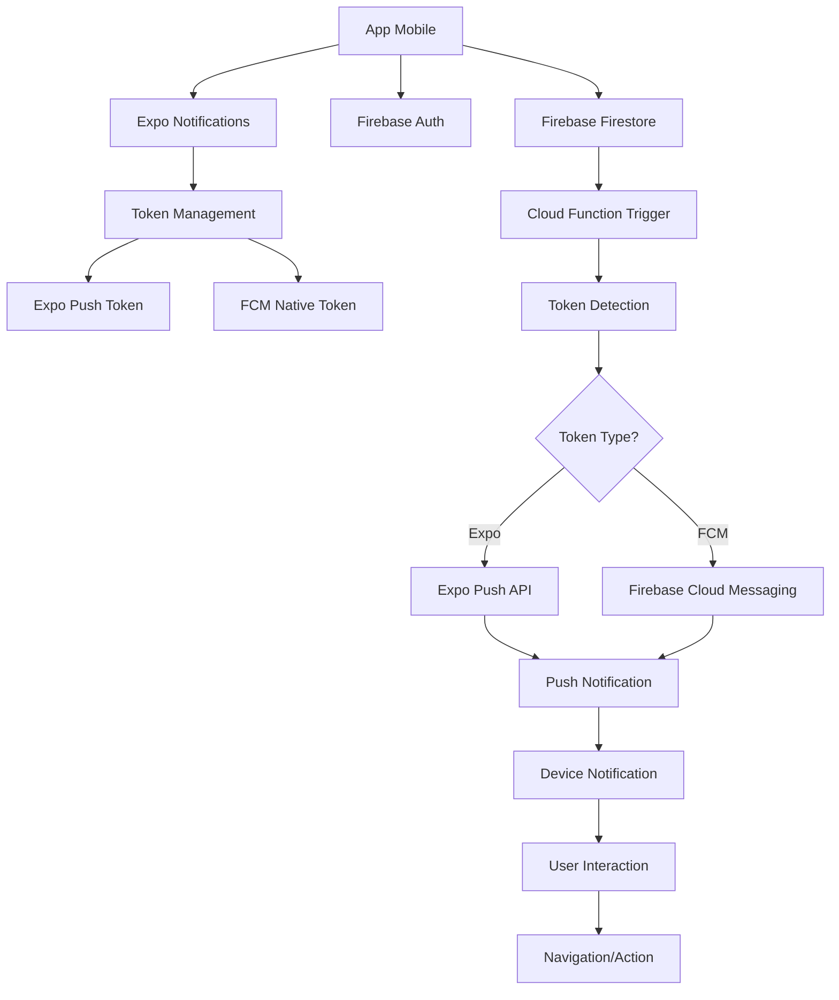

# 📱 Sistema de Notificações - Guia Completo de Implementação

**Baseado na análise do app pediFacil Parceiros**

---

## 📋 Índice

1. [Visão Geral](#visão-geral)
2. [Arquitetura do Sistema](#arquitetura-do-sistema)
3. [Componentes Principais](#componentes-principais)
4. [Implementação Passo a Passo](#implementação-passo-a-passo)
5. [Como Usar em Outro App](#como-usar-em-outro-app)
6. [Características Especiais](#características-especiais)
7. [Troubleshooting](#troubleshooting)

---

## 🎯 Visão Geral

O sistema de notificações do app pediFacil Parceiros é uma solução robusta e escalável que combina múltiplas tecnologias para garantir entrega confiável de notificações push. O sistema foi projetado para funcionar tanto em desenvolvimento (Expo) quanto em produção (builds nativos).

### Funcionalidades Principais:
- ✅ Notificações push em tempo real
- ✅ Notificações locais
- ✅ Persistência no banco de dados
- ✅ Suporte híbrido (Expo + FCM nativo)
- ✅ Navegação automática baseada em dados
- ✅ Gerenciamento de permissões
- ✅ Tratamento de erros robusto

---

## 🏗️ Arquitetura do Sistema



### Componentes da Arquitetura:

1. **Frontend (React Native/Expo)**
   - Gerenciamento de tokens
   - Configuração de permissões
   - Listeners de notificações
   - Navegação baseada em dados

2. **Backend (Firebase)**
   - Firestore para armazenamento
   - Cloud Functions para processamento
   - Authentication para segurança
   - Cloud Messaging para push

3. **Integração Externa**
   - Expo Push API
   - Firebase Cloud Messaging
   - APNs (iOS)
   - FCM (Android)

---

## 📦 Componentes Principais

### 1. **Configuração Base (app.json)**

```json
{
  "expo": {
    "plugins": [
      [
        "expo-notifications",
        {
          "icon": "./assets/images/notifications.png",
          "androidMode": "default",
          "androidCollapsedTitle": "pediFacil Parceiros",
          "iosDisplayInForeground": true
        }
      ]
    ],
    "ios": {
      "infoPlist": {
        "UIBackgroundModes": [
          "remote-notification"
        ]
      }
    },
    "android": {
      "permissions": [
        "RECEIVE_BOOT_COMPLETED",
        "VIBRATE",
        "NOTIFICATIONS"
      ]
    }
  }
}
```

### 2. **Dependências Necessárias (package.json)**

```json
{
  "dependencies": {
    "expo-notifications": "~0.29.14",
    "firebase": "^12.1.0",
    "firebase-admin": "^13.1.0",
    "@react-native-async-storage/async-storage": "^1.23.1",
    "expo-device": "~7.0.3",
    "expo-constants": "~17.0.7",
    "axios": "^1.9.0"
  }
}
```

---

## 🛠️ Implementação Passo a Passo

### **Passo 1: Configuração do Firebase**

Crie o arquivo `src/config/firebase.ts`:

```typescript
import { initializeApp, getApps } from 'firebase/app';
import { getAuth, initializeAuth, getReactNativePersistence } from 'firebase/auth';
import { getFirestore } from 'firebase/firestore';
import { getFunctions } from 'firebase/functions';
import AsyncStorage from '@react-native-async-storage/async-storage';

const firebaseConfig = {
  apiKey: "sua-api-key",
  authDomain: "seu-projeto.firebaseapp.com",
  databaseURL: "https://seu-projeto-default-rtdb.firebaseio.com",
  projectId: "seu-projeto-id",
  storageBucket: "seu-projeto.appspot.com",
  messagingSenderId: "123456789",
  appId: "1:123456789:web:abcdef123456",
  measurementId: "G-XXXXXXXXXX"
};

// Inicializa o Firebase apenas se não houver apps já inicializados
let app;
try {
  const apps = getApps();
  if (apps.length === 0) {
    app = initializeApp(firebaseConfig);
  } else {
    app = apps[0];
  }
} catch (error) {
  const apps = getApps();
  if (apps.length > 0) {
    app = apps[0];
  } else {
    throw new Error('Não foi possível inicializar o Firebase');
  }
}

// Inicializa Auth com persistência AsyncStorage
let auth;
try {
  auth = initializeAuth(app, {
    persistence: getReactNativePersistence(AsyncStorage)
  });
} catch (error) {
  try {
    auth = getAuth(app);
  } catch (authError) {
    console.error('Erro crítico ao obter Firebase Auth:', authError);
    throw authError;
  }
}

export { auth };
export const db = getFirestore(app);
export const functions = getFunctions(app, 'us-central1');
export const rnFirebaseApp = app;
export default app;
```

### **Passo 2: Serviço de Notificações Locais**

Crie o arquivo `src/services/notificationService.ts`:

```typescript
import * as Notifications from 'expo-notifications';
import { Platform } from 'react-native';
import * as Device from 'expo-device';
import Constants from 'expo-constants';
import { collection, query, orderBy, getDocs, doc, updateDoc, where, onSnapshot, deleteDoc, addDoc, serverTimestamp } from 'firebase/firestore';
import { db, auth } from '../config/firebase';

// Configurar comportamento das notificações
Notifications.setNotificationHandler({
  handleNotification: async () => ({
    shouldShowAlert: true,
    shouldPlaySound: true,
    shouldSetBadge: true,
  }),
});

export interface NotificationData {
  id: string;
  body: string;
  createdAt: any;
  data: {
    orderId?: string;
    status?: string;
    userId?: string;
    type?: string;
    action?: string;
    [key: string]: any;
  };
  read: boolean;
  viewed?: boolean;
  title: string;
}

export const notificationService = {
  // Verificar se usuário está autenticado
  isAuthenticated(): boolean {
    return !!auth.currentUser;
  },

  // Solicitar permissões
  async requestPermissions() {
    if (Platform.OS === 'android') {
      await Notifications.setNotificationChannelAsync('default', {
        name: 'default',
        importance: Notifications.AndroidImportance.MAX,
        vibrationPattern: [0, 250, 250, 250],
        lightColor: '#FFA500',
      });
    }

    const { status } = await Notifications.requestPermissionsAsync({
      ios: {
        allowAlert: true,
        allowBadge: true,
        allowSound: true,
        allowDisplayInCarPlay: true,
        allowCriticalAlerts: true,
        provideAppNotificationSettings: true,
        allowProvisional: true,
      },
    });
    
    return status === 'granted';
  },

  // Obter token de notificação
  async getNotificationToken() {
    if (!Device.isDevice) return null;
    
    const permissionGranted = await this.requestPermissions();
    if (!permissionGranted) return null;

    try {
      const token = (await Notifications.getExpoPushTokenAsync({
        projectId: Constants.expoConfig?.extra?.eas?.projectId,
      })).data;
      
      return token;
    } catch (error) {
      console.error('Erro ao obter token:', error);
      return null;
    }
  },

  // Enviar notificação local
  async sendLocalNotification(title: string, body: string, data: any = {}) {
    await Notifications.scheduleNotificationAsync({
      content: {
        title,
        body,
        data,
        sound: true,
        vibrate: [0, 250, 250, 250],
        priority: Notifications.AndroidNotificationPriority.HIGH,
      },
      trigger: null, // Enviar imediatamente
    });
  },

  // Buscar todas as notificações do usuário
  async getNotifications(): Promise<NotificationData[]> {
    try {
      const user = auth.currentUser;
      if (!user) return [];

      const notificationsRef = collection(db, 'users', user.uid, 'notifications');
      const q = query(notificationsRef, orderBy('createdAt', 'desc'));
      const querySnapshot = await getDocs(q);

      const notifications: NotificationData[] = [];
      querySnapshot.forEach((doc) => {
        const data = doc.data();
        notifications.push({
          id: doc.id,
          title: data.title,
          body: data.body,
          createdAt: data.createdAt?.toDate() || new Date(),
          read: data.read || false,
          viewed: data.viewed || false,
          data: data.data || {}
        });
      });

      return notifications;
    } catch (error) {
      console.error('Erro ao buscar notificações:', error);
      return [];
    }
  },

  // Marcar notificação como lida
  async markAsRead(notificationId: string): Promise<void> {
    try {
      const user = auth.currentUser;
      if (!user) throw new Error('Usuário não autenticado');

      const notificationRef = doc(db, 'users', user.uid, 'notifications', notificationId);
      await updateDoc(notificationRef, {
        read: true
      });
    } catch (error) {
      console.error('Erro ao marcar notificação como lida:', error);
      throw error;
    }
  },

  // Configurar escuta de notificações em tempo real
  setupNotificationsListener(callback: (notifications: NotificationData[]) => void): () => void {
    try {
      const user = auth.currentUser;
      if (!user) throw new Error('Usuário não autenticado');

      const notificationsRef = collection(db, 'users', user.uid, 'notifications');
      const q = query(notificationsRef, orderBy('createdAt', 'desc'));
      
      return onSnapshot(q, (snapshot) => {
        const notifications: NotificationData[] = [];
        
        snapshot.forEach((doc) => {
          const data = doc.data();
          notifications.push({
            id: doc.id,
            title: data.title,
            body: data.body,
            createdAt: data.createdAt?.toDate() || new Date(),
            read: data.read || false,
            viewed: data.viewed || false,
            data: data.data || {}
          });
        });
        
        callback(notifications);
      });
    } catch (error) {
      console.error('Erro ao configurar listener de notificações:', error);
      return () => {};
    }
  }
};
```

### **Passo 3: Serviço de Push Notifications**

Crie o arquivo `src/services/pushNotificationService.ts`:

```typescript
import { Platform } from 'react-native';
import { doc, updateDoc, serverTimestamp } from 'firebase/firestore';
import { db, auth } from '../config/firebase';
import * as Notifications from 'expo-notifications';
import * as Device from 'expo-device';
import { router } from 'expo-router';

export const pushNotificationService = {
  // Navegar para tela específica
  navigateToScreen(screen: string) {
    setTimeout(() => {
      router.push(screen);
    }, 300);
  },

  // Solicitar permissões de notificação
  async requestUserPermission() {
    if (Platform.OS === 'android') {
      await Notifications.setNotificationChannelAsync('default', {
        name: 'default',
        importance: Notifications.AndroidImportance.MAX,
        vibrationPattern: [0, 250, 250, 250],
        lightColor: '#FFA500',
        sound: 'default',
      });
    }

    const { status } = await Notifications.requestPermissionsAsync({
      ios: {
        allowAlert: true,
        allowBadge: true,
        allowSound: true,
        allowDisplayInCarPlay: true,
        allowCriticalAlerts: true,
        provideAppNotificationSettings: true,
        allowProvisional: true,
      },
    });
    
    return status === 'granted';
  },

  // Salvar token no banco de dados
  async saveTokenToDatabase(token: string) {
    try {
      const user = auth.currentUser;
      if (!user) return;

      const userRef = doc(db, 'users', user.uid);
      await updateDoc(userRef, {
        fcmToken: token,
        deviceInfo: {
          lastUpdated: new Date(),
          platform: Platform.OS,
          version: Platform.Version,
          tokenType: 'device_push'
        },
        lastTokenUpdate: serverTimestamp()
      });
    } catch (error) {
      console.error('Erro ao salvar token no banco de dados:', error);
    }
  },

  // Inicializar o serviço completo de notificações
  async initialize() {
    try {
      // Obter token
      const token = await notificationService.getNotificationToken();
      if (!token) return () => {};

      // Salvar no banco
      await this.saveTokenToDatabase(token);

      // Configurar resposta para quando uma notificação é clicada
      const responseSubscription = Notifications.addNotificationResponseReceivedListener(
        response => {
          const data = response.notification.request.content.data;
          this.handleNotificationClick(data);
        }
      );
      
      return () => {
        Notifications.removeNotificationSubscription(responseSubscription);
      };
    } catch (error) {
      console.error('Erro ao inicializar serviço de notificações push:', error);
      return () => {};
    }
  },

  // Lidar com clique na notificação
  handleNotificationClick(data: any) {
    if (data.screen) {
      this.navigateToScreen(data.screen);
    }
  }
};
```

### **Passo 4: Cloud Function para Push Notifications**

Crie o arquivo `functions/index.js`:

```javascript
const functions = require('firebase-functions');
const admin = require('firebase-admin');
const axios = require('axios');

admin.initializeApp();

// Trigger quando nova notificação é criada
exports.onNotificationCreated = functions.firestore
  .document('users/{userId}/notifications/{notificationId}')
  .onCreate(async (snapshot, context) => {
    try {
      const userId = context.params.userId;
      const notificationId = context.params.notificationId;
      const notificationData = snapshot.data();
      
      console.log(`🚀 Nova notificação ${notificationId} criada para o usuário ${userId}`);
      
      // Buscar token do usuário
      const userRef = admin.firestore().collection('users').doc(userId);
      const userDoc = await userRef.get();
      
      if (!userDoc.exists) {
        console.log(`❌ Usuário ${userId} não encontrado no Firestore`);
        return null;
      }
      
      const userData = userDoc.data();
      const fcmToken = userData.fcmToken;
      
      if (!fcmToken) {
        console.log(`⚠️ Token FCM não encontrado para o usuário ${userId}`);
        return null;
      }
      
      console.log(`✅ Token encontrado para usuário ${userId}:`, fcmToken.substring(0, 20) + '...');
      
      // Detectar tipo de token
      const isExpoToken = fcmToken.startsWith('ExponentPushToken[');
      
      const title = notificationData.title || 'Nova notificação';
      const body = notificationData.body || 'Você tem uma nova notificação';

      let response;

      if (isExpoToken) {
        // Enviar via Expo Push
        console.log('📤 Enviando via Expo Push...');
        
        const expoMessage = {
          to: fcmToken,
          sound: 'default',
          title: title,
          body: body,
          data: {
            notificationId: notificationId,
            userId: userId,
            timestamp: new Date().toISOString(),
          },
        };

        response = await axios.post('https://exp.host/--/api/v2/push/send', expoMessage, {
          headers: {
            'Accept': 'application/json',
            'Accept-encoding': 'gzip, deflate',
            'Content-Type': 'application/json',
          },
        });
        
        console.log('✅ Notificação enviada via Expo Push:', response.data);
      } else {
        // Enviar via FCM
        console.log('📤 Enviando via FCM...');
        
        const fcmMessage = {
          notification: {
            title: title,
            body: body,
          },
          data: {
            notificationId: notificationId,
            userId: userId,
            timestamp: new Date().toISOString(),
          },
          token: fcmToken,
          android: {
            priority: 'high',
            notification: {
              sound: 'default',
              priority: 'high',
              channelId: 'default'
            }
          },
          apns: {
            payload: {
              aps: {
                sound: 'default',
                badge: 1
              }
            }
          }
        };

        response = await admin.messaging().send(fcmMessage);
        console.log('✅ Notificação enviada via FCM:', response);
      }

      // Marcar a notificação como processada
      await snapshot.ref.update({
        'data.processedByFCM': true,
        'data.fcmProcessedAt': admin.firestore.FieldValue.serverTimestamp(),
        'data.tokenType': isExpoToken ? 'expo' : 'fcm',
        'data.deliveryMethod': isExpoToken ? 'expo_push' : 'fcm'
      });
      
      console.log('🏷️ Notificação marcada como processada');
      
      return null;
    } catch (error) {
      console.error('❌ Erro ao processar notificação:', error);
      
      // Tentar marcar a notificação como falha
      try {
        await snapshot.ref.update({
          'data.fcmError': error.message,
          'data.fcmErrorAt': admin.firestore.FieldValue.serverTimestamp()
        });
      } catch (updateError) {
        console.error('❌ Erro ao marcar falha na notificação:', updateError);
      }
      
      return null;
    }
  });
```

### **Passo 5: Inicialização no App Principal**

Atualize o arquivo `src/App.tsx`:

```typescript
import { useEffect, useState } from 'react';
import { pushNotificationService } from './services/pushNotificationService';
import { notificationService } from './services/notificationService';

function App() {
  const [notificationsInitialized, setNotificationsInitialized] = useState(false);

  useEffect(() => {
    const initNotifications = async () => {
      try {
        console.log('🔔 Inicializando sistema de notificações...');
        
        // Inicializar push notifications
        const unsubscribeFCM = await pushNotificationService.initialize();
        
        // Configurar notificações locais
        await notificationService.setupPushNotifications();

        setNotificationsInitialized(true);
        console.log('✅ Sistema de notificações inicializado com sucesso!');

        // Cleanup na desmontagem
        return () => {
          if (unsubscribeFCM) {
            unsubscribeFCM();
            console.log('🧹 Listeners de notificação removidos');
          }
        };
      } catch (error) {
        console.error('❌ Erro ao inicializar notificações:', error);
      }
    };

    initNotifications();
  }, []);

  // Resto do componente...
  return (
    // Seu JSX aqui
  );
}

export default App;
```

### **Passo 6: Gerenciamento de Notificações**

Crie o arquivo `src/services/notificationManager.ts`:

```typescript
import { collection, addDoc, serverTimestamp } from 'firebase/firestore';
import { db, auth } from '../config/firebase';
import { notificationService } from './notificationService';

export const notificationManager = {
  // Criar nova notificação
  async createNotification(userId: string, title: string, body: string, data: any = {}) {
    try {
      const notificationsRef = collection(db, 'users', userId, 'notifications');
      
      const notificationData = {
        title,
        body,
        data,
        read: false,
        createdAt: serverTimestamp()
      };
      
      const docRef = await addDoc(notificationsRef, notificationData);
      console.log(`✅ Notificação criada com ID: ${docRef.id}`);
      return docRef.id;
    } catch (error) {
      console.error('❌ Erro ao criar notificação:', error);
      throw error;
    }
  },

  // Enviar notificação de teste
  async sendTestNotification(userId: string) {
    try {
      const notificationId = await this.createNotification(
        userId,
        '🧪 Teste de Notificação',
        'Esta é uma notificação de teste para verificar se o sistema está funcionando!',
        {
          type: 'test',
          testId: Date.now(),
          screen: 'notifications'
        }
      );
      
      console.log('✅ Teste de notificação concluído com sucesso!');
      return notificationId;
    } catch (error) {
      console.error('❌ Erro no teste de notificação:', error);
      throw error;
    }
  },

  // Enviar notificação de status de pedido
  async sendOrderStatusNotification(userId: string, orderId: string, status: string) {
    try {
      const getNotificationData = (status: string) => {
        switch (status) {
          case 'preparing':
            return {
              title: 'Pedido Aceito',
              body: `Seu pedido #${orderId.slice(-4)} foi aceito e está sendo preparado!`
            };
          case 'ready':
            return {
              title: 'Pedido Pronto',
              body: `Seu pedido #${orderId.slice(-4)} está pronto!`
            };
          case 'out_for_delivery':
            return {
              title: 'Pedido em Entrega',
              body: `Seu pedido #${orderId.slice(-4)} saiu para entrega!`
            };
          case 'delivered':
            return {
              title: 'Pedido Entregue',
              body: `Seu pedido #${orderId.slice(-4)} foi entregue. Bom apetite!`
            };
          case 'cancelled':
            return {
              title: 'Pedido Cancelado',
              body: `Seu pedido #${orderId.slice(-4)} foi cancelado.`
            };
          default:
            return {
              title: 'Status do Pedido Atualizado',
              body: `O status do seu pedido #${orderId.slice(-4)} foi atualizado.`
            };
        }
      };
      
      const notificationData = getNotificationData(status);
      
      const notificationId = await this.createNotification(
        userId,
        notificationData.title,
        notificationData.body,
        {
          orderId,
          status,
          type: 'order_status',
          screen: 'orders'
        }
      );
      
      console.log(`✅ Notificação de status enviada com sucesso! ID: ${notificationId}`);
      return notificationId;
    } catch (error) {
      console.error('❌ Erro ao enviar notificação de status:', error);
      throw error;
    }
  }
};
```

---

## 🚀 Como Usar em Outro App

### **1. Instalação das Dependências**

```bash
# Instalar dependências do Expo
npx expo install expo-notifications expo-device expo-constants

# Instalar dependências do Firebase
npm install firebase firebase-admin @react-native-async-storage/async-storage axios
```

### **2. Configuração do app.json**

Adicione as configurações de notificações no seu `app.json`:

```json
{
  "expo": {
    "plugins": [
      [
        "expo-notifications",
        {
          "icon": "./assets/notification-icon.png",
          "androidMode": "default",
          "androidCollapsedTitle": "Seu App",
          "iosDisplayInForeground": true
        }
      ]
    ],
    "ios": {
      "infoPlist": {
        "UIBackgroundModes": [
          "remote-notification"
        ]
      }
    },
    "android": {
      "permissions": [
        "RECEIVE_BOOT_COMPLETED",
        "VIBRATE",
        "NOTIFICATIONS"
      ]
    }
  }
}
```

### **3. Configuração do Firebase**

1. **Crie um projeto no Firebase Console**
   - Acesse [console.firebase.google.com](https://console.firebase.google.com)
   - Clique em "Adicionar projeto"
   - Siga o assistente de configuração

2. **Configure os serviços necessários**
   - **Authentication**: Habilite o método de login desejado
   - **Firestore**: Crie um banco de dados
   - **Cloud Functions**: Habilite o serviço
   - **Cloud Messaging**: Configure para push notifications

3. **Baixe os arquivos de configuração**
   - `google-services.json` (Android)
   - `GoogleService-Info.plist` (iOS)
   - Coloque-os na raiz do projeto

4. **Configure as Cloud Functions**
   - Instale o Firebase CLI: `npm install -g firebase-tools`
   - Faça login: `firebase login`
   - Inicialize: `firebase init functions`
   - Copie o código da Cloud Function fornecida acima

### **4. Implementação dos Serviços**

1. **Copie os arquivos de serviço** fornecidos acima
2. **Adapte para seu projeto**:
   - Ajuste a estrutura de dados do Firestore
   - Modifique a navegação específica do seu app
   - Personalize o design e comportamento das notificações

### **5. Teste do Sistema**

```typescript
// Função de teste para verificar se tudo está funcionando
const testNotificationSystem = async () => {
  try {
    console.log('🧪 Iniciando teste do sistema de notificações...');
    
    // Teste 1: Verificar se o token foi obtido
    const token = await notificationService.getNotificationToken();
    if (!token) {
      throw new Error('Token de notificação não foi obtido');
    }
    console.log('✅ Token obtido com sucesso');
    
    // Teste 2: Enviar notificação de teste
    const user = auth.currentUser;
    if (user) {
      await notificationManager.sendTestNotification(user.uid);
      console.log('✅ Notificação de teste enviada');
    }
    
    // Teste 3: Verificar listener em tempo real
    const unsubscribe = notificationService.setupNotificationsListener((notifications) => {
      console.log('📱 Notificações recebidas:', notifications.length);
    });
    
    // Limpar listener após 5 segundos
    setTimeout(() => {
      unsubscribe();
      console.log('✅ Teste concluído com sucesso!');
    }, 5000);
    
  } catch (error) {
    console.error('❌ Erro no teste:', error);
  }
};
```

---

## ⭐ Características Especiais do Sistema

### 1. **Arquitetura Híbrida**
- ✅ Suporta tanto tokens Expo quanto FCM nativos
- ✅ Detecção automática do tipo de token
- ✅ Fallback entre diferentes métodos de entrega

### 2. **Tempo Real**
- ✅ Usa Firestore listeners para atualizações instantâneas
- ✅ Notificações aparecem imediatamente no app
- ✅ Sincronização automática entre dispositivos

### 3. **Persistência**
- ✅ Todas as notificações são salvas no banco de dados
- ✅ Histórico completo de notificações
- ✅ Status de leitura persistente

### 4. **Flexibilidade**
- ✅ Diferentes tipos de notificação
- ✅ Dados customizados para cada notificação
- ✅ Navegação automática baseada em dados

### 5. **Robustez**
- ✅ Tratamento de erros abrangente
- ✅ Logs detalhados para debugging
- ✅ Fallbacks para falhas de entrega

### 6. **Escalabilidade**
- ✅ Cloud Functions processam notificações eficientemente
- ✅ Suporte a milhares de usuários simultâneos
- ✅ Otimização automática de recursos

---

## 🔧 Troubleshooting

### **Problemas Comuns e Soluções**

#### 1. **Token não é obtido**
```typescript
// Verificar se o dispositivo é físico
if (!Device.isDevice) {
  console.log('⚠️ Notificações não funcionam em simulador');
}

// Verificar permissões
const { status } = await Notifications.getPermissionsAsync();
if (status !== 'granted') {
  console.log('❌ Permissões não concedidas');
}
```

#### 2. **Notificações não chegam**
```typescript
// Verificar se o token está salvo no Firestore
const userDoc = await getDoc(doc(db, 'users', userId));
const token = userDoc.data()?.fcmToken;
if (!token) {
  console.log('❌ Token não encontrado no banco');
}
```

#### 3. **Cloud Function não executa**
```javascript
// Verificar logs no Firebase Console
// Verificar se a função está deployada
// Verificar se o trigger está configurado corretamente
```

#### 4. **Navegação não funciona**
```typescript
// Verificar se o router está configurado
// Verificar se a tela existe
// Verificar se os dados estão corretos
```

### **Logs Úteis para Debug**

```typescript
// Adicionar logs detalhados
console.log('🔑 Token:', token?.substring(0, 20) + '...');
console.log('📱 Tipo de token:', isExpoToken ? 'Expo' : 'FCM');
console.log('📋 Dados da notificação:', notificationData);
console.log('✅ Resposta da API:', response);
```

### **Comandos Úteis**

```bash
# Verificar logs do Firebase
firebase functions:log

# Deploy das funções
firebase deploy --only functions

# Verificar status do projeto
firebase projects:list

# Testar notificação manualmente
firebase functions:shell
```

---

## 📚 Recursos Adicionais

### **Documentação Oficial**
- [Expo Notifications](https://docs.expo.dev/versions/latest/sdk/notifications/)
- [Firebase Cloud Messaging](https://firebase.google.com/docs/cloud-messaging)
- [Firebase Cloud Functions](https://firebase.google.com/docs/functions)
- [Firebase Firestore](https://firebase.google.com/docs/firestore)

### **Ferramentas Úteis**
- [Firebase Console](https://console.firebase.google.com)
- [Expo Push Tool](https://expo.dev/notifications)
- [Firebase CLI](https://firebase.google.com/docs/cli)

### **Exemplos de Uso**
- Notificações de pedidos
- Lembretes de eventos
- Atualizações de status
- Promoções e ofertas
- Mensagens de sistema

---

## 🎯 Conclusão

Este sistema de notificações é uma solução completa e robusta que pode ser adaptada para qualquer tipo de aplicativo. A arquitetura híbrida garante compatibilidade tanto em desenvolvimento quanto em produção, enquanto as Cloud Functions garantem escalabilidade e confiabilidade.

**Principais benefícios:**
- ✅ Implementação relativamente simples
- ✅ Alta confiabilidade de entrega
- ✅ Suporte a múltiplas plataformas
- ✅ Escalabilidade automática
- ✅ Manutenção facilitada

**Próximos passos:**
1. Implemente o sistema básico
2. Teste em diferentes cenários
3. Personalize conforme suas necessidades
4. Monitore e otimize conforme necessário

---

*Este guia foi baseado na análise do sistema de notificações do app pediFacil Parceiros e pode ser adaptado para qualquer projeto React Native/Expo.*

